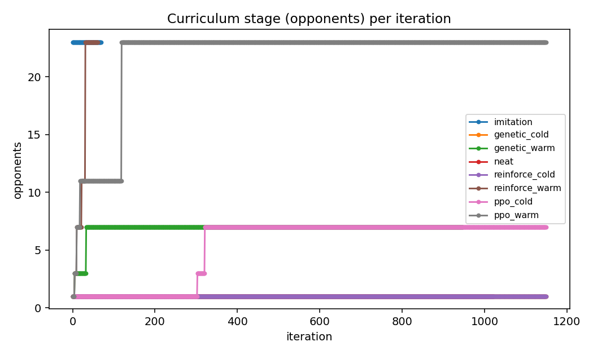
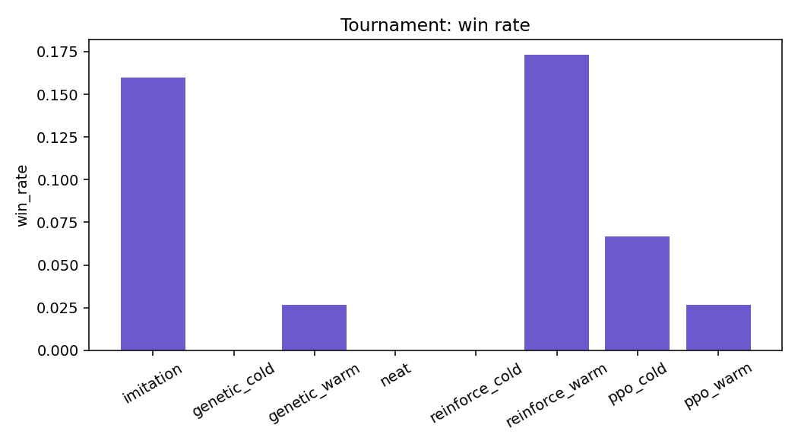

# Results: every method to the win criterion, then the tournament

**Run:** `results/full_methods_20260903_025758` (the `results/` folder is not in the repo; this folder keeps the report, the numbers and the charts).
**Command:** `experiments/run_full.sh`, first block:

```bash
python experiments/run_comparison.py --methods imitation,genetic,neat,reinforce,ppo --pairs --curriculum \
  --iterations 150 --until-win 0.5 --window 5 --extend-iterations 1000 --extend-hours 2 \
  --games 75 --workers 6 --seed 0 --name full_methods
```

**Machine:** an 8-core Mac, 6 workers, about 11 hours of wall clock (02:58 to 13:57) including the extension phase.
**Files here:** [report.md](report.md) (generated by the run), [results.csv](results.csv) (every number), [summary.json.gz](summary.json.gz) (the full learning curves, gzipped because 1,150 iterations of eight variants is 3.4 MB), [config.json](config.json) (the exact configuration), and the charts named below.

## What was run

Eight variants of the one-learner-against-the-voting-brain problem. `imitation` trains against the full field of 23 voting tributes (no curriculum). Every other variant climbs the opponent curriculum (1, 3, 7, 11, then 23 voting opponents, promoted when the learner wins at least half of its validation games over five iterations, never by timeout). `_cold` starts from random weights; `_warm` starts from the imitation champion. NEAT has no warm start because it evolves its own topology.

Each variant trained for up to 150 iterations, stopping early once it won a majority of its validation games over five iterations played at the final stage (the **win criterion**). Any variant that had not met the criterion by 150 then kept training, with the same weights or population, for up to 1,000 more iterations or two hours (the **extension**). Finally every champion played the same 75 seeded games as the learner, greedily, in 6 of the 24 slots against voting tributes.

## The criterion: who learned to win, and how fast

| variant | reached | iterations to criterion | seconds to criterion | iterations trained | extension iterations | highest stage reached |
| --- | --- | --- | --- | --- | --- | --- |
| imitation | yes | 70 | 218 | 70 | 0 | 23 opponents (no ladder) |
| reinforce_warm | yes | 62 | 175 | 62 | 0 | 23 opponents |
| ppo_warm | no | - | - | 1150 | 1000 | 23 opponents (from iteration 120) |
| ppo_cold | no | - | - | 1150 | 1000 | 7 opponents (from iteration 322) |
| genetic_warm | no | - | - | 948 | 798 | 7 opponents (from iteration 34) |
| genetic_cold | no | - | - | 1150 | 1000 | 1 opponent |
| reinforce_cold | no | - | - | 1150 | 1000 | 1 opponent |
| neat | no | - | - | 1023 | 873 | 1 opponent |

The curriculum ladder each variant climbed ([curriculum_by_method.png](curriculum_by_method.png)):



Promotion points (iteration, opponents after promotion):

| variant | promotions |
| --- | --- |
| reinforce_warm | (6, 3), (11, 7), (23, 11), (32, 23); criterion at 62 |
| ppo_warm | (6, 3), (11, 7), (19, 11), (120, 23) |
| genetic_warm | (6, 3), (34, 7) |
| ppo_cold | (304, 3), (322, 7) |
| genetic_cold, reinforce_cold, neat | none |

## The tournament: 75 games per champion against voting tributes

| rank | variant | tournament win rate | mean score | mean survival (ticks) | mean kills |
| --- | --- | --- | --- | --- | --- |
| 1 | reinforce_warm | 0.17 | 0.43 | 216 | 0.30 |
| 2 | imitation | 0.16 | -0.36 | 174 | 0.64 |
| 3 | ppo_cold | 0.07 | 1.06 | 233 | 0.01 |
| 4 | ppo_warm | 0.03 | 0.66 | 219 | 0.02 |
| 5 | genetic_warm | 0.03 | -0.48 | 166 | 0.33 |
| 6 | reinforce_cold | 0.00 | -1.30 | 130 | 0.01 |
| 7 | genetic_cold | 0.00 | -1.81 | 90 | 0.01 |
| 8 | neat | 0.00 | -2.04 | 78 | 0.00 |



A win is a game in which one of the six learner copies was the sole victor. Six copies in a field of 24 would win a quarter of the games if every tribute were equal, so a rate of 0.17 means the best learner is still a little weaker than a voting tribute on average, while winning far more than the cold starts. The score and survival columns tell a second story: cold PPO scores highest and survives longest because it learned to hide and outlast, but it rarely finishes a game as the victor.

## Claims the experiment supports

1. **Imitation gives the instincts; reward learning then improves on the teacher.** Warm REINFORCE met the criterion in 62 iterations (175 s) and won the tournament with a win rate of 0.17 against imitation's 0.16, with higher survival (216 against 174 ticks). Its entropy started at 0.45 (a sharp policy copied from the teacher) and stayed low.
2. **Cold starts are slower by orders of magnitude, and most never get there.** No cold variant met the criterion in 1,150 iterations. Cold REINFORCE's policy entropy fell only from 2.69 to 2.41 (the maximum for this action set is about 2.7), so after 5,200 seconds it was still close to uniform: with sparse rewards and 24 trajectories per update, the gradient signal is too weak to sharpen a random policy in this budget. Cold PPO, which makes several passes per batch, was the only cold start to leave the first rung: it reached seven opponents at iteration 322.
3. **Warm is better than cold for REINFORCE and the GA, but not for PPO in this run.** Warm REINFORCE beat cold (0.17 against 0.00), warm GA beat cold (0.03 against 0.00), but cold PPO beat warm PPO (0.07 against 0.03). Warm PPO climbed to the full field by iteration 120 and then could not hold a majority there; its entropy rose from 0.45 to 1.82 over training, so PPO's updates un-sharpened the imitation policy. PPO's learning rate and entropy bonus are set for cold starts and are too aggressive for a warm one. That is a tuning result, not a verdict on PPO.
4. **The evolutionary methods are the slowest learners here.** The GA and NEAT did sharpen their networks (entropy 1.84 to about 1.0) and their survival crept up (85 to 115 ticks for the cold GA), but at a rate that would need tens of thousands of generations: fitness is dominated by dying of thirst early, and neither method has a gradient to follow. The warm GA reached seven opponents at generation 34 and then stalled there for 900 generations.
5. **Simplest to implement:** imitation at 525 lines; NEAT is the largest at 981. **Fastest to a winning policy:** warm REINFORCE. **Most stable score:** PPO (see [entropy_by_method.png](entropy_by_method.png) and [score_by_time.png](score_by_time.png)).

So, for this game, the recommendation is: pretrain by imitation, then fine-tune with a small-step policy gradient (REINFORCE as configured), because it is the cheapest route to a policy that beats its teacher. PPO needs a gentler learning rate for warm starts before it can be judged fairly, and evolution is the wrong tool for a 5,872-weight network with sparse rewards.

## Limitations, honestly

- **One seed.** Every variant ran once with seed 0. Validation plays 2 games per iteration (1 for imitation), so each iteration's win rate is 0, 0.5 or 1. The criterion averages five of them, which is why the curves in [win_rate_by_method.png](win_rate_by_method.png) are spiky.
- **Champions were chosen by validation score, not by stage.** REINFORCE and PPO kept the policy with the best validation return over the whole run, and the GA and NEAT the genome with the best training fitness. A score against one opponent is not comparable with one against seven, so a variant that climbed the ladder can send an easy-rung policy to the tournament. This mostly affects cold PPO and warm PPO. Stage-aware champion selection (highest stage, then validation win rate, then score) is the next change.
- **Training clocks include waiting time for extended variants.** A trainer's cumulative clock kept running while it waited for the other variants to finish their first budget, so [win_rate_by_time.png](win_rate_by_time.png) and [score_by_time.png](score_by_time.png) stretch the extended variants to the right. The `seconds_to_criterion` and `train_seconds` columns exclude the wait.
- **The criterion is greedy.** Training games sample actions; validation plays the argmax. Cold REINFORCE won half its training games with six near-random copies against one opponent while winning none greedily, because the argmax of a flat policy is a single repeated action.
- **Tournament win rates are low for everyone.** The best learner wins 13 of 75 games. The tournament measures "is the learner the last one standing", the hardest possible criterion for a game where 23 others also want to win.

## Charts

| Chart | What it shows |
| --- | --- |
| [tournament_win_rate.png](tournament_win_rate.png) | Share of the 75 tournament games won, per champion |
| [tournament_mean_score.png](tournament_mean_score.png) | Mean episode return in the tournament |
| [tournament_mean_survival.png](tournament_mean_survival.png) | Mean ticks survived in the tournament |
| [win_rate_by_method.png](win_rate_by_method.png) | Validation win rate per iteration, one line per variant |
| [win_rate_by_time.png](win_rate_by_time.png) | The same against the trainer's clock (see the limitation above) |
| [curriculum_by_method.png](curriculum_by_method.png) | Opponents per iteration: the ladder each variant climbed |
| [score_by_time.png](score_by_time.png) | Mean training score against the clock |
| [entropy_by_method.png](entropy_by_method.png) | Policy entropy per iteration: how sharp each policy is |
| [length_by_method.png](length_by_method.png) | Mean ticks survived per iteration |
| [train_seconds.png](train_seconds.png) | Wall-clock training time per variant |
| [lines_of_code.png](lines_of_code.png) | Lines of code each method needs |
