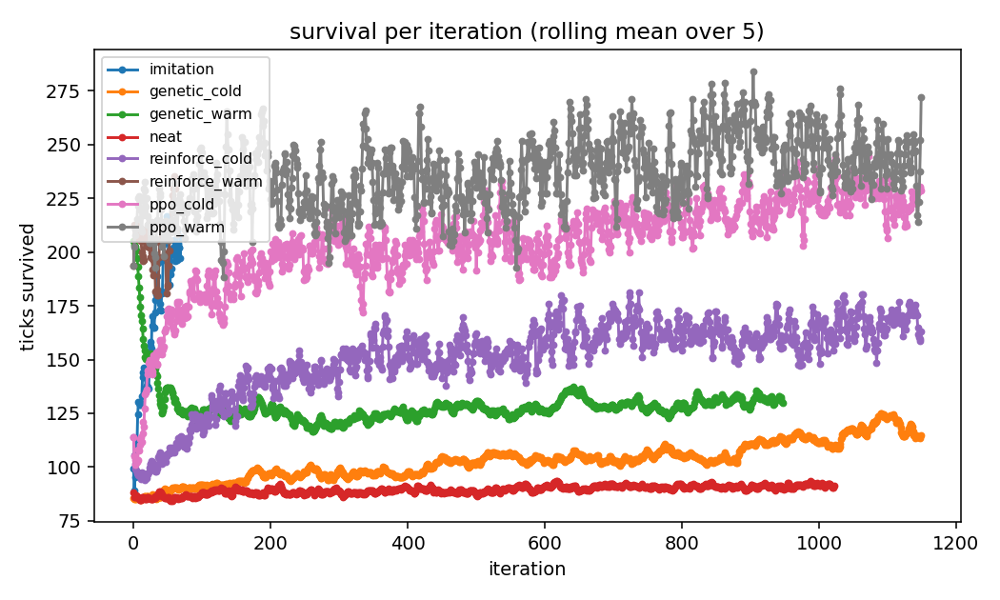
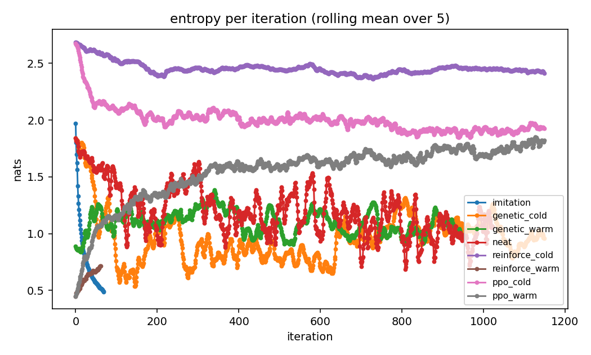
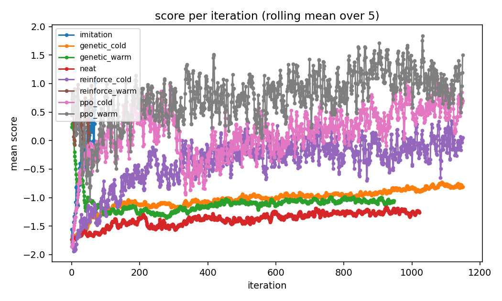
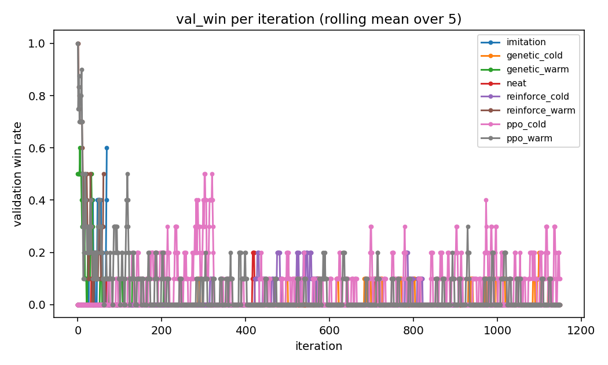
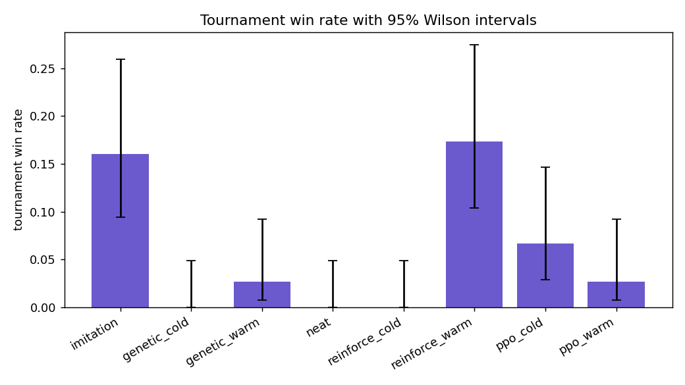
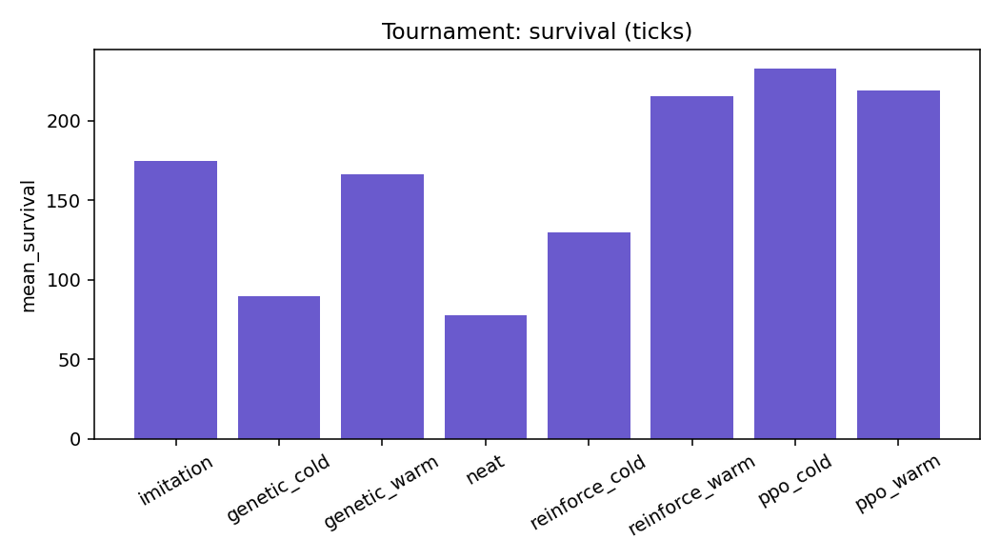
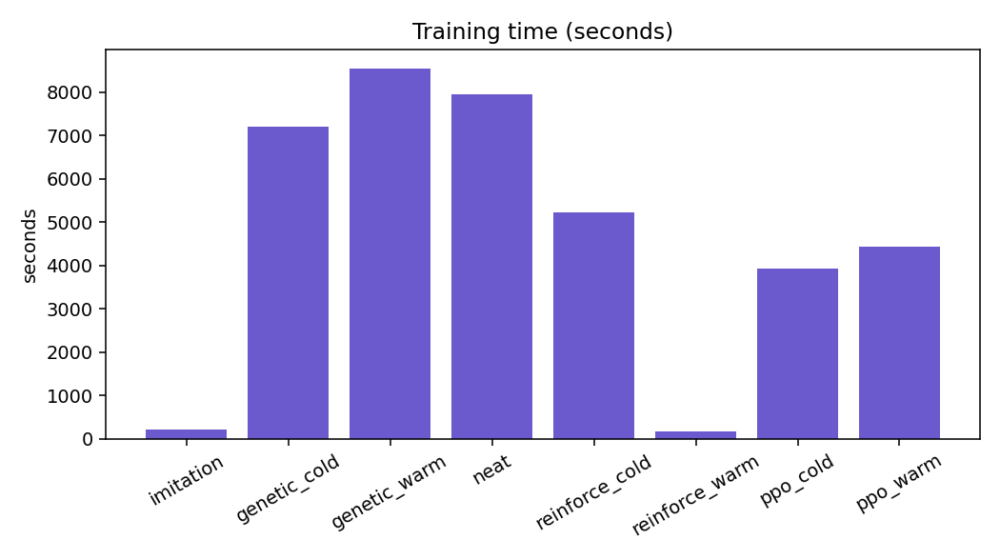
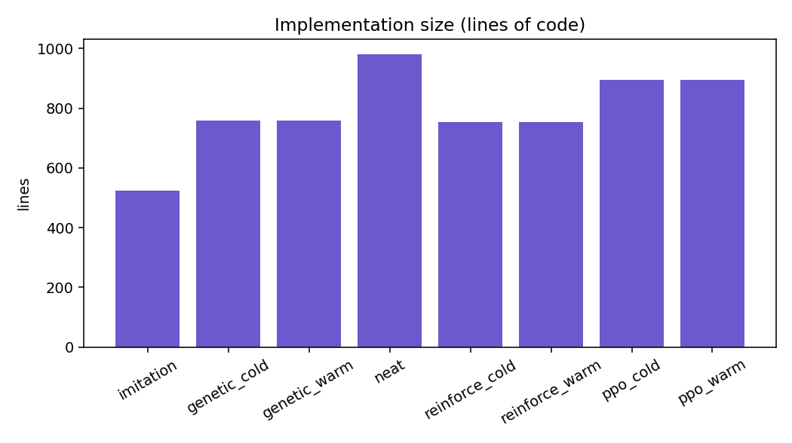
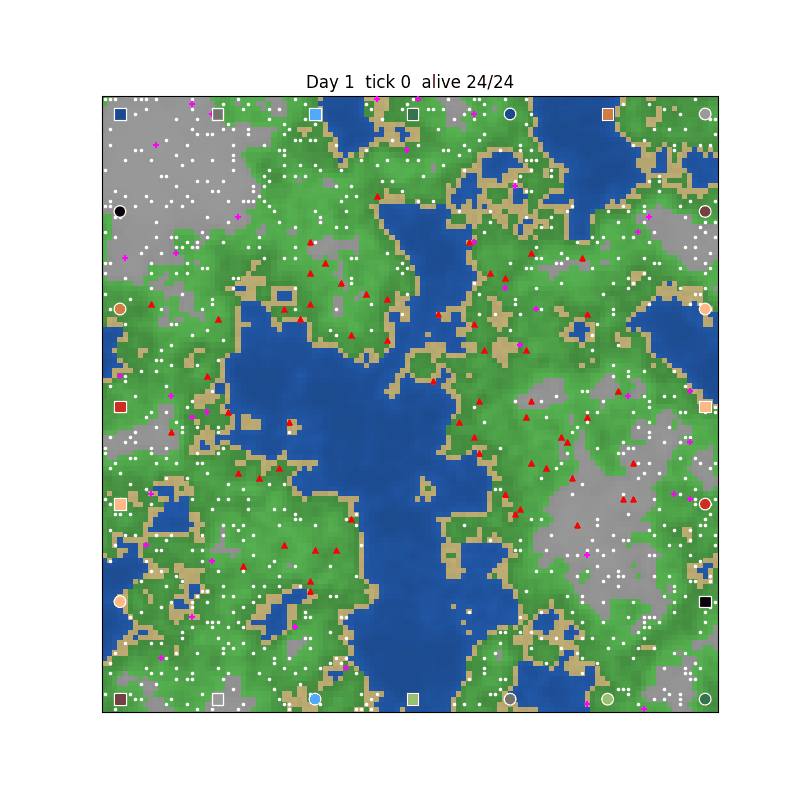

# Which way should a tribute learn? Imitation, evolution and policy gradients in a simulated Hunger Games

*Experiment of 2026-09-03. Runs `full_methods_20260903_025758`, `sizes_20260903_135744` and `initializers_20260903_143756`, produced by `experiments/run_full.sh`. Every number in this paper is in [results.csv](results.csv), [analysis/stats.md](analysis/stats.md) and the sibling run folders; every chart is in this folder.*

## Abstract

We ask which training method makes the most sense for a neural-network tribute in a simulated Hunger Games, how expensive each one is, and whether starting from a copy of a hand-written strategy (a "warm start") beats starting from random weights. Five methods train one network against copies of the chapter 4 voting brain of the video that inspired the simulator: imitation learning, a genetic algorithm, NEAT, REINFORCE and PPO. Every variant trains until it wins a majority of its validation games at the top of an opponent curriculum, with slow starters given up to 1,000 extra iterations, and every champion then plays the same 75 seeded games. Two variants met the criterion: imitation at epoch 70 and REINFORCE warm-started from the imitation champion at iteration 62. No cold start met it within 1,150 iterations. In the tournament, warm REINFORCE won 13 of 75 games and imitation 12 (95 percent Wilson intervals 0.10 to 0.27 and 0.09 to 0.26), both significantly more than every cold start (Fisher exact p = 0.0003 against 0 wins) but not different from each other (p = 1.0). Warm starts beat cold starts for REINFORCE (p = 0.0001) but not for the genetic algorithm (2 against 0 wins, p = 0.50) or PPO, where the cold start won more (5 against 2, p = 0.44) because PPO's update un-sharpened the copied policy (entropy 0.45 to 1.82). Two supplementary runs show that imitation needs a network of at least 64 by 32 hidden nodes to copy the teacher, that PPO fine-tuning does best on the smallest network tried (16 hidden nodes, 18 of 75 wins), and that all-zero initial weights never learn. We conclude that, for this game, instincts should come from imitation and improvement from a small-step policy gradient, that PPO needs a gentler learning rate for warm starts, and that evolution is the wrong tool for a 5,872-weight network with sparse rewards. The paper closes with the limitations of a single-seed study and the redesigned curriculum the next experiment will use.

## 1. Introduction

### 1.1 Background

The video *Infinite Hunger Games* [1] builds a Hunger Games simulator one chapter at a time and, in chapter 4, gives every tribute a **voting brain**: eight hand-tuned weights that score the options "hunt", "drink", "eat", "loot", "flee" and "rest" every tick, so that a thirsty tribute walks to water and a wounded one hides. This project re-implements that simulator in Python ([../../../README.md](../../../README.md)): a Perlin-noise arena, 24 tributes in 12 districts, water, food, weapons and medkits, sponsors, a slowly shrinking game maker circle, and a 24-day cutoff. The voting brain is the baseline opponent and, as it turns out, the teacher.

Two further videos shaped the training side. A PPO zombie-arena video [2] trains one network against a growing number of zombies, with a dashboard showing score bars, an event monitor and entropy. A Monopoly video [3] evolves networks with NEAT and ranks them with a tournament. This project takes the single-learner framing and the curriculum from the first, the tournament from the second, and asks the question neither of them asks: **across methods, which one is worth the effort?**

### 1.2 Prior work in this project

The trainers were written one at a time ([../../CHANGELOG.md](../../../CHANGELOG.md)). The first neural tributes, trained by a genetic algorithm from random weights, died of thirst: with sparse rewards and 5,872 weights, nothing in the fitness signal said "drink". That motivated **imitation pretraining** (behaviour cloning from the voting brain), which cut dehydration deaths from 10 in 12 games to 2 and became the warm start for every other method. The **curriculum** (1, 3, 7, 11, then 23 voting opponents) was adopted from [2] and first promoted on mean score; it now promotes only when the learner wins a majority of its validation games, because a network that survives but never wins was being promoted to fields it could not beat. A smoke test of the comparison (3 iterations per method) found that champions were being declared "reached" the moment they were promoted to the final stage; the criterion now requires every iteration of the window to have been played at the final stage.

### 1.3 Research questions and hypotheses

1. **Which method reaches a winning policy, and how fast?** Hypothesis: the gradient methods (REINFORCE, PPO) reach it faster than the evolutionary ones (GA, NEAT), because they follow a gradient instead of sampling weight perturbations.
2. **Is a warm start from imitation better than a cold start?** Hypothesis: warm starts learn faster **and** end with a stronger network, because imitation supplies the survival instincts the sparse reward never teaches.
3. **Which method is simplest to implement, and why are the others slower or worse?** Measured by lines of code and by the learning curves.
4. **Supplementary:** does the network's size or its initialiser change the answer?

## 2. Materials and methods

### 2.1 The simulator

`hunger_games` (version 0.7.0), Python 3.11, numpy. Arena 120 by 120 cells of Perlin-noise terrain (water, sand, grass, forest, mountain), 24 tributes, ring layout, chaos 0.5, game maker circle on, sponsors on, cannon-and-sky knowledge of who is left, `max_days` 24 (a draw if more than one tribute remains). Tributes perceive a 50-value vector (needs, wounds, the nearest water, food, weapon and enemy, the circle, the count of tributes left) and choose from a 16-way action menu. See [../../docs/perception.md](../../perception.md) and [../../docs/actions.md](../../actions.md).

### 2.2 The learner and its opponents

Every method trains **one** network. In a training game six copies of it occupy learner slots spread around the roster (slots 0, 4, 8, 12, 16, 20 of 24) and the other tributes use the voting brain. A game counts as **won** when one of the copies is the sole victor. The network is a multilayer perceptron with hidden layers of 64 and 32 nodes (5,872 weights), Xavier-uniform initialised, with a softmax over the menu; the same class serves as a policy for the gradient methods and as a genome for the evolutionary ones ([../../docs/brain/neural.md](../../brain/neural.md)).

### 2.3 The five methods

| Method | What is learned | Signal | Lines of code |
| --- | --- | --- | --- |
| Imitation | Weights, by supervised learning from the voting brain's choices in 12 recorded games | Cross-entropy against the teacher's action | 525 |
| Genetic algorithm | Weights, by selection, crossover and mutation over a population of 48 | Episode return of each genome as the learner | 759 |
| NEAT | Weights and topology, with species | Same | 981 |
| REINFORCE | Weights, by the policy gradient with a learned value baseline; learning rate 1e-3, entropy bonus 0.01, 4 episodes per epoch | Sparse reward: placement, kills, days survived | 753 |
| PPO | As REINFORCE, with the clipped surrogate objective, generalised advantage estimation and several passes per batch | Same | 894 |

Lines of code are counted over the files each method needs, so PPO counts REINFORCE's file too. Full settings: [../../docs/training/](../../training/init.md).

### 2.4 Curriculum, warm starts, criterion and extension

**Curriculum.** The gradient and evolutionary variants start against **1** voting opponent and are promoted through 3, 7 and 11 to the full field of **23** when their validation win rate over the last five iterations reaches 0.5. There is no timeout: a variant that cannot win stays where it is. Imitation trains against the full field throughout.

**Warm and cold.** `_cold` variants start from random weights. `_warm` variants start from the imitation champion (the GA population is the champion plus mutated copies at a quarter of the usual spread). NEAT has no warm start because it evolves its own topology.

**Validation.** Every iteration, the current network plays 2 greedy games (1 for imitation) on fixed seeds; the win rate over those games is the signal for promotion and for the criterion.

**Win criterion.** A variant stops when its validation win rate averaged over the last 5 iterations, all played at the final stage, reaches 0.5. The iterations and seconds it took are recorded.

**Extension.** Every variant gets 150 iterations first. Any variant still short of the criterion then continues, with the same weights or population, for up to 1,000 more iterations or two hours, after the quick variants have finished. So the record shows how long a slow starter really needs, and its final network still enters the tournament.

**Champion.** Each trainer keeps its best network so far. In this run that was the best validation return (gradient methods) or the best training fitness (evolutionary methods), regardless of curriculum stage; section 5 discusses the consequence, and the code now ranks by stage first.

### 2.5 The tournament

Every champion plays the same 75 games (seeds 50000 to 50074), greedily, with six copies in the learner slots against 18 voting tributes on the base configuration. We record the win rate (games in which a copy was the sole victor), the mean episode return, the mean ticks survived and the mean kills per copy.

### 2.6 Statistics

Seventy-five games give a coarse win rate, so every tournament win rate is reported with a **95 percent Wilson interval**. Differences between two champions are tested with a **two-sided Fisher exact test** on their wins and losses. Whether a variant was still improving when its budget ended is measured by the **slope of a straight line** through its survival, score and entropy against the iteration, with the slope's p-value. All three are computed by `experiments/analyze_comparison.py` ([../../docs/experiments/analyze_comparison.md](../../experiments/analyze_comparison.md)); the tables are in [analysis/stats.md](analysis/stats.md). Learning curves are shown as rolling means over 5 iterations, the criterion window.

### 2.7 Procedure and hardware

```bash
bash experiments/run_full.sh          # the three runs below, in order
python experiments/analyze_comparison.py results/full_methods_20260903_025758 --window 5
python experiments/render_champions.py results/full_methods_20260903_025758
```

Run 1, `full_methods`: methods `imitation,genetic,neat,reinforce,ppo`, `--pairs --curriculum --iterations 150 --until-win 0.5 --window 5 --extend-iterations 1000 --extend-hours 2 --games 75 --workers 6 --seed 0`. Run 2, `sizes`: imitation and warm PPO with hidden layers 16, 64x32 and 128x64, 80 iterations. Run 3, `initializers`: imitation and warm PPO with Xavier uniform, He uniform and zeros, 80 iterations. One seed (0) per variant. An 8-core Mac, 6 worker processes; run 1 took about 11 hours (02:58 to 13:57), runs 2 and 3 about 40 and 30 minutes. The machine was shared with a browser and, twice, swapped heavily; single iterations then took minutes instead of seconds, which the time charts show as flat stretches.

## 3. Results

### 3.1 Data preparation

The raw outputs are one `learning.json` per variant (one row per iteration with the mean score, validation score, validation win rate, entropy, survival, stage, opponents and seconds), `results.csv` (one row per variant) and `summary.json` (the tournament numbers and every learning row). Two things were cleaned before analysis. The trainer clocks of extended variants included the hours they waited for the other variants' first budgets; `train_seconds` and `seconds_to_criterion` exclude that wait, but `cumulative_seconds` in the learning rows, and so the by-time charts, include it (fixed in the code for future runs). And the criterion table of the generated report printed `70.0` and `nan` where it meant 70 and "never"; the tables below use the cleaned values.

### 3.2 Who reached the criterion

| variant | reached | iterations to criterion | seconds to criterion | iterations trained | of which extension | highest stage reached (promotion iterations) |
| --- | --- | --- | --- | --- | --- | --- |
| imitation | yes | 70 | 218 | 70 | 0 | full field throughout |
| reinforce_warm | yes | 62 | 175 | 62 | 0 | 23 opponents (6, 11, 23, 32) |
| ppo_warm | no | - | - | 1150 | 1000 | 23 opponents (6, 11, 19, 120) |
| ppo_cold | no | - | - | 1150 | 1000 | 7 opponents (304, 322) |
| genetic_warm | no | - | - | 948 | 798 | 7 opponents (6, 34) |
| genetic_cold | no | - | - | 1150 | 1000 | 1 opponent |
| reinforce_cold | no | - | - | 1150 | 1000 | 1 opponent |
| neat | no | - | - | 1023 | 873 | 1 opponent |


*Figure 1. Opponents faced per iteration. Warm REINFORCE (brown) climbs the whole ladder in 32 iterations; warm PPO (grey) reaches the full field at 120 and stays; cold PPO (pink) is the only cold start to leave the first rung.*

### 3.3 Learning curves



*Figure 2. Ticks survived per iteration, rolling mean over 5. Warm PPO survives longest (up to 294 ticks) without winning; cold REINFORCE and cold PPO climb steadily; the GA and NEAT stay below 130.*



*Figure 3. Policy entropy (nats; the maximum for 16 actions is 2.77). The warm starts begin at 0.45, a sharp copy of the teacher. Cold REINFORCE (purple) barely leaves the top; warm PPO (grey) drifts upward throughout.*



*Figure 4. Mean training score per iteration. Note that the scores of different variants are earned against different numbers of opponents.*



*Figure 5. Validation win rate (rolling mean over 5): the quantity the criterion and the promotions are judged on.*

Straight-line slopes over the whole run (per 100 iterations; p-values for the slope):

| variant | survival slope | p | score slope | p | entropy slope | p |
| --- | --- | --- | --- | --- | --- | --- |
| imitation (70 it) | +146.0 | 2e-12 | +3.24 | 8e-8 | -1.26 | 4e-21 |
| reinforce_warm (62 it) | +21.4 | 0.23 | +0.31 | 0.51 | +0.37 | 4e-26 |
| ppo_warm | +2.6 | 5e-25 | +0.09 | 2e-52 | +0.06 | 2e-288 |
| ppo_cold | +5.1 | 6e-150 | +0.07 | 5e-50 | -0.02 | 1e-188 |
| reinforce_cold | +4.3 | 2e-143 | +0.09 | 4e-93 | -0.01 | 1e-84 |
| genetic_cold | +2.4 | <1e-300 | +0.05 | <1e-300 | +0.00 | 0.26 |
| genetic_warm | -0.1 | 0.24 | +0.01 | 2e-4 | -0.01 | 4e-13 |
| neat | +0.5 | 3e-110 | +0.04 | 8e-229 | -0.05 | 4e-95 |

### 3.4 The tournament

| rank | variant | wins / 75 | win rate | 95% Wilson interval | mean score | survival (ticks) | kills per copy |
| --- | --- | --- | --- | --- | --- | --- | --- |
| 1 | reinforce_warm | 13 | 0.173 | 0.104 to 0.274 | 0.43 | 216 | 0.30 |
| 2 | imitation | 12 | 0.160 | 0.094 to 0.259 | -0.36 | 174 | 0.64 |
| 3 | ppo_cold | 5 | 0.067 | 0.029 to 0.147 | 1.06 | 233 | 0.01 |
| 4 | ppo_warm | 2 | 0.027 | 0.007 to 0.092 | 0.66 | 219 | 0.02 |
| 5 | genetic_warm | 2 | 0.027 | 0.007 to 0.092 | -0.48 | 166 | 0.33 |
| 6 | reinforce_cold | 0 | 0.000 | 0.000 to 0.049 | -1.30 | 130 | 0.01 |
| 7 | genetic_cold | 0 | 0.000 | 0.000 to 0.049 | -1.81 | 90 | 0.01 |
| 8 | neat | 0 | 0.000 | 0.000 to 0.049 | -2.04 | 78 | 0.00 |



*Figure 6. Tournament win rate per champion with 95 percent Wilson intervals. Six copies in a field of 24 would win a quarter of the games if all tributes were equal.*



*Figure 7. Mean ticks survived per copy in the tournament. Cold PPO survives longest and wins little: it learned to hide and outlast.*

### 3.5 Statistical tests

| comparison | wins | difference | Fisher p |
| --- | --- | --- | --- |
| reinforce_warm against reinforce_cold | 13 against 0 | +0.173 | **0.0001** |
| genetic_warm against genetic_cold | 2 against 0 | +0.027 | 0.50 |
| ppo_warm against ppo_cold | 2 against 5 | -0.040 | 0.44 |
| reinforce_warm against imitation | 13 against 12 | +0.013 | 1.00 |
| ppo_cold against imitation | 5 against 12 | -0.093 | 0.12 |
| ppo_warm against imitation | 2 against 12 | -0.133 | **0.009** |
| genetic_warm against imitation | 2 against 12 | -0.133 | **0.009** |
| genetic_cold, neat, reinforce_cold against imitation | 0 against 12 | -0.160 | **0.0003** each |

### 3.6 Cost

 

*Figure 8. Wall-clock training seconds per variant (left) and lines of code per method (right).*

| variant | train seconds | seconds per iteration |
| --- | --- | --- |
| imitation | 218 | 3.1 |
| reinforce_warm | 175 | 2.8 |
| ppo_cold | 3,941 | 3.4 |
| ppo_warm | 4,435 | 3.9 |
| reinforce_cold | 5,239 | 4.6 |
| genetic_cold | 7,197 | 6.3 |
| neat | 7,961 | 7.8 |
| genetic_warm | 8,555 | 9.0 |

### 3.7 The champions in action

One tournament game per champion (seed 50000, the first tournament seed), rendered by `experiments/render_champions.py` with every fourth tick drawn (`--step 4 --max-frames 300`, about 1.5 MB per GIF). The gold-starred tributes are the champion's copies; the captions in [gifs/index.md](gifs/index.md) give the outcome of each game: whether a copy won, how long the copies survived and how many kills they made.

| champion | game |
| --- | --- |
| reinforce_warm |  |
| imitation |  |
| ppo_cold |  |
| ppo_warm |  |
| genetic_warm |  |
| reinforce_cold |  |
| genetic_cold |  |
| neat |  |

### 3.8 Supplementary run: network size

Imitation and warm PPO on hidden layers of 16 (1,088 weights), 64x32 (5,872) and 128x64 (15,824), 80 iterations each ([../sizes/README.md](../sizes/README.md)).

| variant | imitation validation accuracy | reached criterion | tournament wins / 75 | Wilson interval |
| --- | --- | --- | --- | --- |
| imitation_16 | 0.72 | no | 0 | 0.000 to 0.049 |
| imitation_64x32 | 0.84 | yes (70) | 12 | 0.094 to 0.259 |
| imitation_128x64 | 0.87 | yes (60) | 9 | 0.064 to 0.212 |
| ppo_16 | | no (11 opponents) | **18** | 0.157 to 0.348 |
| ppo_64x32 | | no (11 opponents) | 13 | 0.104 to 0.274 |
| ppo_128x64 | | no (11 opponents) | 10 | 0.074 to 0.226 |

Every PPO variant beat the 16-node imitation copy (Fisher p from 0.0000 to 0.0014). The 16-node PPO's 18 wins against the 64x32 PPO's 13 is not significant (p = 0.42, computed from the same table).


*Figure 9. The sizes run's tournament.*

### 3.9 Supplementary run: initialiser

Imitation and warm PPO with Xavier uniform, He uniform and all-zero initial weights ([../initializers/README.md](../initializers/README.md)).

| variant | imitation validation accuracy | reached criterion | tournament wins / 75 |
| --- | --- | --- | --- |
| imitation_xavier_uniform | 0.84 | yes (70) | 12 |
| imitation_he_uniform | 0.80 | yes (28) | 1 |
| imitation_zeros | 0.11 | no | 0 |
| ppo_xavier_uniform | | no (11 opponents) | 13 |
| ppo_he_uniform | | no (11 opponents) | 4 |
| ppo_zeros | | no (1 opponent) | 0 |

He uniform's imitation copy won significantly fewer games than Xavier's (1 against 12, p = 0.002); its PPO fine-tune's 4 against 13 falls short of significance (p = 0.06). Zeros never learned: imitation accuracy stayed at 0.11, the share of the most common teacher action.


*Figure 10. The initialisers run's tournament.*

## 4. Discussion

### 4.1 Interpretation against the hypotheses

**Hypothesis 1 (gradients beat evolution) is supported, with a caveat about the criterion.** The two variants that met the criterion are both gradient-trained, and the two evolutionary methods never left the first rung. The trend slopes show that the GA and NEAT *were* learning (survival +2.4 and +0.5 ticks per 100 generations, p below 1e-100), just at a rate that would need tens of thousands of generations. Their signal is the placement of six copies that mostly die of thirst before they meet anyone; there is no gradient to say which of 5,872 weights to move. The caveat is that cold REINFORCE and cold PPO did not meet the criterion either, and section 4.3 says why.

**Hypothesis 2 (warm starts learn faster and end better) is supported for REINFORCE, not shown for the GA, and contradicted for PPO.** Warm REINFORCE climbed the ladder in 32 iterations, met the criterion in 62, and won 13 games to cold REINFORCE's 0 (p = 0.0001): both parts of the hypothesis hold. The warm GA reached seven opponents and won 2 games to the cold GA's 0, a difference that 75 games cannot distinguish from luck (p = 0.50). Warm PPO climbed the ladder faster than anyone except warm REINFORCE and then fell apart: it could not hold a majority against the full field for 1,000 iterations, and its cold twin beat it in the tournament (5 against 2, p = 0.44, again not significant). Figure 3 explains the mechanism. Warm PPO's entropy rose from 0.45 to 1.82 over training (slope +0.06 per 100 iterations, p = 2e-288): every update pushed the copied policy back toward uniform, so the instincts imitation supplied were being erased faster than the reward could replace them. PPO's several passes per batch, at the learning rate and entropy bonus chosen for cold starts, are too aggressive for a policy that is already sharp. REINFORCE's single pass moved the same starting policy gently enough to keep it (entropy 0.45 to 0.71).

**Hypothesis 3.** Imitation is the simplest (525 lines) and needs a teacher; REINFORCE adds 228 lines and, warm-started, is the fastest to a winning policy (175 seconds). PPO adds another 141 lines for stability that, in this run, did not pay off. NEAT is the largest and slowest per generation.

**Hypothesis 4.** Size matters in two opposite directions: imitation needs at least 64x32 to copy the teacher (16 nodes reached 72 percent accuracy and won nothing), but PPO fine-tuning did best on 16 nodes, which had the cleanest gradient from 24 sparse-reward trajectories per update. The initialiser matters less, except that zeros is a hard failure (the symmetry problem: identical hidden nodes receive identical gradients and never diverge).

### 4.2 Why the tournament win rates are low for everyone

The best champion wins 17 percent of games. Six equal tributes among 24 would win 25 percent. So even warm REINFORCE is, per copy, a little weaker than a voting tribute, and imitation is a slightly noisy copy of one. The tournament asks the hardest question the game has ("were you the last one standing"), and a network trained on sparse rewards and two validation games per iteration has had few chances to learn the endgame. The survival column tells the rest: cold PPO learned to live longer than anyone (233 ticks) without learning to win, because outlasting is rewarded every game and winning only rarely.

### 4.3 The cold-start problem is partly a tuning problem

Cold REINFORCE's entropy fell only from 2.69 to 2.41 in 1,150 updates: its policy stayed close to uniform. Its training win rate was nonetheless around 0.5, because six near-random copies against one voting tribute often outlast it, while its validation win rate stayed at 0, because the argmax of a flat policy is one repeated action. The learning rate (1e-3), entropy bonus (0.01) and batch (4 episodes) were chosen so that a warm start would not be wrecked, which is the opposite of what a cold start needs. A sensitivity sweep over those three settings ([../sensitivity/README.md](../sensitivity/README.md), fourteen cold variants, 150 iterations each) confirms it. Sixteen episodes per epoch instead of four took cold PPO to seven opponents by iteration 72 (the default needed 322) and gave the sweep's only tournament wins; an entropy bonus of 0.001 gave the best single-change score; a learning rate of 1e-2 sharpened both methods into poor policies, while 3e-3 improved cold REINFORCE on every measure. From random weights PPO beat REINFORCE at every setting. The defaults are right for warm starts and wrong for cold ones, which is what `--set` is for.

### 4.4 Comparison with the source videos

The zombie-arena video [2] reports PPO learning a curriculum from one to sixteen zombies from scratch. Our cold PPO reached seven opponents in 322 iterations and stalled, which is consistent with that video's much larger training budgets and denser reward (every zombie killed scores), against our sparse placement reward. The Monopoly video [3] finds NEAT competitive; our NEAT never left the first rung, because the Hunger Games network has 50 inputs and 16 outputs and NEAT starts with no hidden nodes, whereas the Monopoly network was small and its fitness dense. The imitation-then-fine-tune pattern that won here is standard practice in robot learning and game AI, where behaviour cloning supplies the prior and reinforcement learning improves on it; the twist in this game is that the teacher is eight hand-written weights.

### 4.5 Limitations

1. **One seed per variant.** The Wilson intervals describe 75 tournament games, not the variance between training runs. A second seed could reorder the middle of the table.
2. **Two validation games per iteration.** Each iteration's win rate is 0, 0.5 or 1; a criterion of five in a row can be met by luck, and the initialisers run shows it (He uniform's imitation met the criterion at epoch 28 with a copy that then won 1 game of 75).
3. **Champions were chosen without regard to stage.** A validation score against one opponent is not comparable with one against seven, so cold PPO and warm PPO may have sent easy-rung policies to the tournament. The code now ranks champions by stage, then validation wins, then score; the next run will use it.
4. **Clocks of extended variants** include the wait for the other variants in the by-time charts (not in the tables). Fixed for future runs.
5. **The curriculum only varies the number of opponents.** Every cold start died of thirst long before it met anyone; there is no rung that teaches drinking. Section 5 describes the replacement.
6. **Hardware noise.** Two stretches of swapping stretched single iterations to minutes.

## 5. Conclusion and next steps

For a neural tribute in this game, the evidence says: get the instincts from imitation, then improve them with a small-step policy gradient. Warm REINFORCE was the fastest to a winning policy, the strongest in the tournament, and the only warm start that kept what imitation gave it. PPO needs a smaller learning rate or entropy bonus before its extra machinery can help a warm start, and evolution cannot search 5,872 weights on a sparse signal in any budget we can afford. The network should stay small: 16 hidden nodes fine-tuned better than 64x32, which in turn copied the teacher better than 16.

The next experiment changes three things the limitations point at. **A curriculum of lessons rather than opponent counts:** survive alone (promotion on days survived, so dehydration and hunger are learned first), survive the arena rules (the circle and sponsors), then win against 1, 3, 7, 11 and 23 opponents, then generalise across spawn layouts, maps and rules. **Training to completion for every method:** each variant continues until it graduates the whole curriculum, so "how long" is measured for all of them, with stage-aware champions. **Size as a second axis:** the best method re-run at 16, 64x32 and 128x64. The settings sweep that section 4.3 introduces will fix the cold-start learning rate first, so that the cold-against-warm question is asked fairly.

## References

1. *Infinite Hunger Games*, YouTube, chapter 4 (the voting brain), https://youtu.be/dS3tgfNN1HM?t=1013. The simulator, districts, resources and the eight-weight voting strategy follow this chapter.
2. The PPO zombie-arena video summarised in the project's second transcript file: one network trained against 1, 2, 4, 8 and 16 zombies with a live dashboard. Source of the single-learner framing, the curriculum and the Train tab's panels.
3. The Monopoly NEAT video in the same file: networks evolved with NEAT and ranked by a tournament. Source of the tournament and the NEAT method.
4. The Battleship strategy video in the same file: head-to-head comparison charts. Source of the comparison layout.
5. Schulman, J., Wolski, F., Dhariwal, P., Radford, A. and Klimov, O. (2017). *Proximal Policy Optimization Algorithms*. arXiv:1707.06347. The clipped surrogate objective used by `training/ppo.py`.
6. Williams, R. J. (1992). *Simple statistical gradient-following algorithms for connectionist reinforcement learning*. Machine Learning 8, 229 to 256. REINFORCE.
7. Stanley, K. O. and Miikkulainen, R. (2002). *Evolving neural networks through augmenting topologies*. Evolutionary Computation 10(2), 99 to 127. NEAT.
8. Pomerleau, D. A. (1989). *ALVINN: An autonomous land vehicle in a neural network*. NIPS 1. Behaviour cloning as pretraining.
9. Wilson, E. B. (1927). *Probable inference, the law of succession, and statistical inference*. Journal of the American Statistical Association 22, 209 to 212. The Wilson interval.
10. Fisher, R. A. (1935). *The Design of Experiments*. Oliver and Boyd. The exact test.
11. Glorot, X. and Bengio, Y. (2010). *Understanding the difficulty of training deep feedforward neural networks*. AISTATS. Xavier initialisation. He, K. et al. (2015). *Delving deep into rectifiers*. ICCV. He initialisation.
12. This project's documentation: [../../docs/research/README.md](../../research/README.md) (experiment design), [../../docs/research/comparison.md](../../research/comparison.md) (the comparison), [../../docs/training/common.md](../../training/common.md) (curriculum, criterion, champion key), [../../CHANGELOG.md](../../../CHANGELOG.md) (how the defaults were reached).
