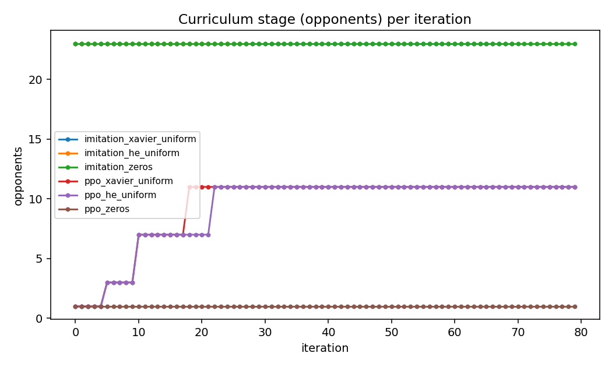
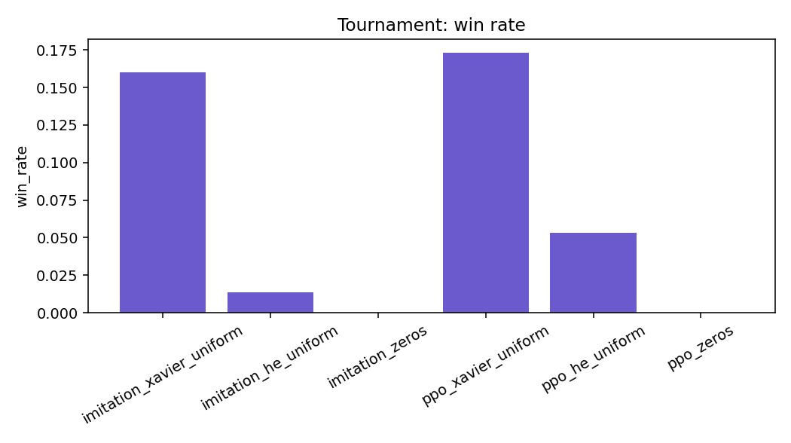

# Results: weight initialisers

**Run:** `results/initializers_20260903_143756`.
**Command:** `experiments/run_full.sh`, third block:

```bash
python experiments/run_comparison.py --methods imitation,ppo --warm --curriculum \
  --initializers xavier_uniform,he_uniform,zeros \
  --iterations 80 --until-win 0.5 --window 5 --games 75 --workers 6 --seed 0 --name initializers
```

**Machine:** the same 8-core Mac, 6 workers, about 30 minutes. No extension phase.
**Files here:** [report.md](report.md), [results.csv](results.csv), [summary.json](summary.json), [config.json](config.json) and the charts named below.

## What was run

The default 64x32 network with three ways of setting its starting weights: Xavier uniform (the default; the spread shrinks with the sum of the layer's fan-in and fan-out), He uniform (the spread shrinks with fan-in only, made for ReLU layers), and all zeros. For each, imitation pretraining against the full field (up to 80 epochs, stopping at the win criterion), then PPO warm-started from that initialiser's imitation champion on the opponent curriculum for up to 80 iterations, then the 75-game tournament.

## Criterion and curriculum

| variant | reached | iterations to criterion | iterations trained | highest stage | validation accuracy (imitation) |
| --- | --- | --- | --- | --- | --- |
| imitation_xavier_uniform | yes | 70 | 70 | 23 opponents (no ladder) | 0.84 |
| imitation_he_uniform | yes | 28 | 28 | 23 opponents | 0.80 |
| imitation_zeros | no | - | 80 | 23 opponents | 0.11 |
| ppo_xavier_uniform | no | - | 80 | 11 opponents (promotions at 6, 11, 19) | |
| ppo_he_uniform | no | - | 80 | 11 opponents (promotions at 6, 11, 23) | |
| ppo_zeros | no | - | 80 | 1 opponent | |



## Tournament

| rank | variant | tournament win rate | mean score | mean survival (ticks) |
| --- | --- | --- | --- | --- |
| 1 | ppo_xavier_uniform | 0.17 | 0.05 | 217 |
| 2 | imitation_xavier_uniform | 0.16 | -0.36 | 174 |
| 3 | ppo_he_uniform | 0.05 | -0.22 | 201 |
| 4 | imitation_he_uniform | 0.01 | -0.80 | 161 |
| 5 | imitation_zeros | 0.00 | -2.07 | 79 |
| 6 | ppo_zeros | 0.00 | -2.07 | 79 |



## What it shows

1. **All-zero weights never learn anything.** With every weight zero, every hidden node computes the same value and receives the same gradient, so they can never become different from each other (the symmetry problem in every textbook). Imitation accuracy stayed at 11 percent, which is the share of the most common teacher action; the policy entropy stayed near the maximum (2.77 to 2.52, only the output biases moved). PPO warm-started from that copy had nothing to build on, and its champion is the same uniform policy: identical tournament numbers to the imitation copy, 79 ticks of survival and no wins.
2. **Xavier uniform and He uniform both copy the teacher; Xavier fine-tuned better.** He uniform met the imitation criterion sooner (epoch 28 against 70) but at a lower validation accuracy (80 against 84 percent), because the criterion only asks for two greedy wins in a row and the earlier stop left a less faithful copy. That difference carried through PPO: 0.17 against 0.05 in the tournament, and He's PPO entropy climbed higher (0.68 to 1.44) than Xavier's (0.45 to 1.17).
3. **The imitation criterion can stop too early.** `imitation_he_uniform` is the clearest case: it satisfied the win criterion at epoch 28 with a copy that then won 1 of 75 tournament games. One validation game per epoch makes "five wins in a row" reachable by luck for a merely adequate copy. Imitation should either validate on more games or be judged on accuracy as well as wins.

The default, Xavier uniform, stays. Zeros is kept in the list as the negative control every initialiser lesson needs.

## Limitations

- One seed. With one validation game per imitation epoch, the epoch at which imitation stops is noisy, and that noise propagates into the PPO comparison (finding 3).
- `ppo_zeros` reports 792 training seconds against about 355 for the others: a uniform policy wanders and dies late in every game, so its rollouts are longer.
- Champions were chosen by validation score rather than curriculum stage, as in the main run.

## Charts

| Chart | What it shows |
| --- | --- |
| [tournament_win_rate.png](tournament_win_rate.png) | Share of tournament games won per champion |
| [tournament_mean_score.png](tournament_mean_score.png) | Mean tournament return |
| [tournament_mean_survival.png](tournament_mean_survival.png) | Mean ticks survived in the tournament |
| [win_rate_by_method.png](win_rate_by_method.png) | Validation win rate per iteration |
| [curriculum_by_method.png](curriculum_by_method.png) | Opponents per iteration |
| [score_by_time.png](score_by_time.png) | Training score against the clock |
| [entropy_by_method.png](entropy_by_method.png) | Policy entropy per iteration |
| [length_by_method.png](length_by_method.png) | Mean ticks survived per iteration |
| [train_seconds.png](train_seconds.png) | Training time per variant |
