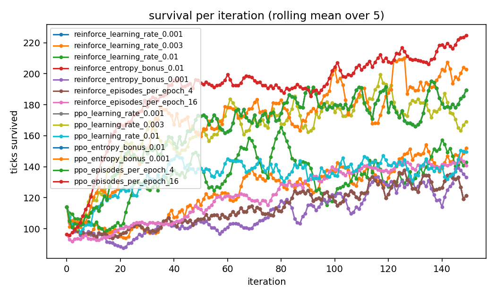
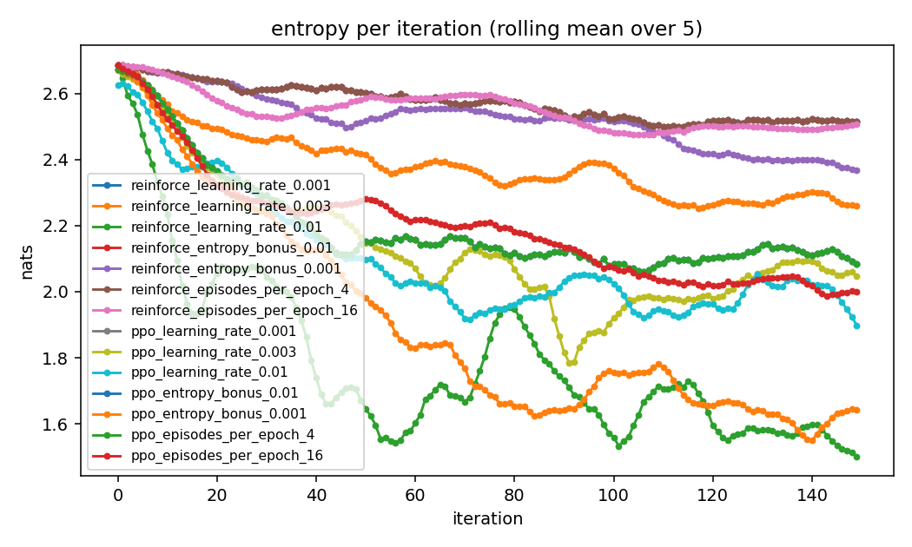
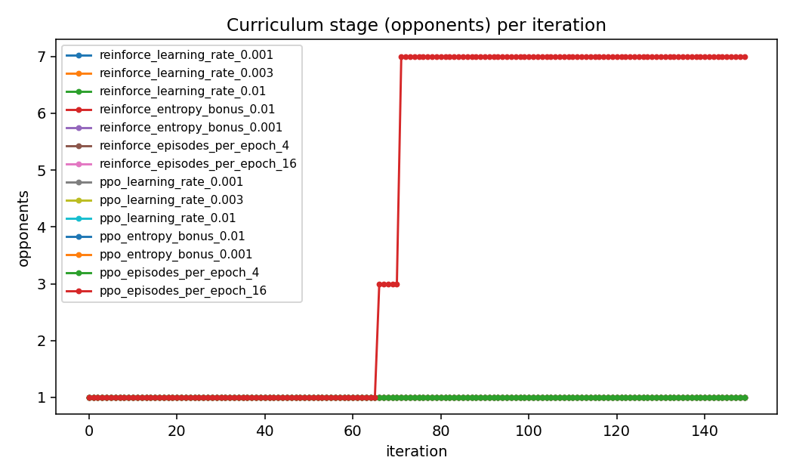

# Results: the cold-start sensitivity sweep

**Run:** `results/sensitivity_20260903_153031`.
**Command:** `experiments/run_sensitivity.sh`:

```bash
python experiments/run_comparison.py --methods reinforce,ppo --curriculum \
  --set learning_rate=1e-3,3e-3,1e-2 --set entropy_bonus=0.01,0.001 --set episodes_per_epoch=4,16 \
  --iterations 150 --until-win 0.5 --window 5 --games 75 --workers 6 --seed 0 --name sensitivity
```

**Machine:** the same 8-core Mac, 6 workers, about 2 hours 20 minutes. No extension phase: the question is the speed of the first 150 iterations.
**Files here:** [report.md](report.md), [results.csv](results.csv), [summary.json](summary.json), [config.json](config.json), the charts named below and [analysis/stats.md](analysis/stats.md).

## Why this run

The main experiment ([../full_methods/paper.md](../full_methods/paper.md), section 4.3) found cold REINFORCE still close to a uniform policy after 1,150 updates and asked whether that was the problem or the settings. The defaults (learning rate 1e-3, entropy bonus 0.01, 4 episodes per epoch) were chosen so that a warm start from imitation would not be wrecked. This sweep changes one of the three at a time for cold REINFORCE and cold PPO on the opponent curriculum, seven variants per method; `learning_rate_0.001`, `entropy_bonus_0.01` and `episodes_per_epoch_4` are the defaults and, with the same seed, give identical numbers.

## What happened

No variant met the win criterion in 150 iterations, and only one left the first rung: PPO with 16 episodes per epoch was promoted to three opponents at iteration 67 and to seven at 72. Learning within the first rung differed a lot:

| variant | entropy at 150 | survival at 150 (ticks) | training win rate, last 20 | validation win rate, last 20 | score, last 20 | tournament wins / 75 |
| --- | --- | --- | --- | --- | --- | --- |
| reinforce, lr 1e-3 (default) | 2.53 | 132 | 0.12 | 0.00 | -1.01 | 0 |
| reinforce, lr 3e-3 | 2.25 | 156 | 0.31 | 0.03 | -0.27 | 0 |
| reinforce, lr 1e-2 | 1.45 | 129 | 0.15 | 0.00 | -0.78 | 0 |
| reinforce, entropy 0.001 | 2.36 | 124 | 0.24 | 0.00 | -0.89 | 0 |
| reinforce, 16 episodes | 2.51 | 135 | 0.22 | 0.00 | -0.50 | 0 |
| ppo, lr 1e-3 (default) | 2.09 | 202 | 0.39 | 0.05 | 0.07 | 0 |
| ppo, lr 3e-3 | 2.03 | 185 | 0.29 | 0.05 | -0.36 | 0 |
| ppo, lr 1e-2 | 1.86 | 144 | 0.21 | 0.00 | -0.77 | 0 |
| ppo, entropy 0.001 | 1.63 | 172 | 0.42 | 0.12 | 0.23 | 0 |
| ppo, 16 episodes | 1.99 | 222 | 0.11 | 0.20 | 0.33 | **4** |

(The three default duplicates are omitted; the maximum entropy for 16 actions is 2.77.)







## What it shows

1. **Batch size is the strongest lever.** Sixteen episodes per epoch (96 learner trajectories per update instead of 24) took cold PPO from the first rung to the third in 72 iterations, where the main run's default cold PPO needed 322, and gave it the only validation wins that count against the criterion (0.20 over the last 20 iterations) and the only tournament wins of the sweep (4 of 75). It costs four times the games per iteration (2,277 seconds against 399), so per game it is roughly even, but per update the gradient is far less noisy. For REINFORCE, 16 episodes doubled the training win rate and the score slope (+0.88 against +0.61 per 100 iterations) without changing entropy.
2. **A smaller entropy bonus helps PPO sharpen.** Entropy 0.001 brought PPO's entropy from 2.09 to 1.63 at 150 iterations and gave the best score among the single-change variants (0.23) and a validation win rate of 0.12. For REINFORCE the same change did little (2.36 against 2.53).
3. **A higher learning rate sharpens the policy but not into a good one.** At 1e-2 both methods reached the lowest entropy of the sweep (1.45 and 1.86) and the lowest survival (129 and 144 ticks): large steps commit early to a poor policy. At 3e-3 REINFORCE improved on every measure over the default (survival 156 against 132, training wins 0.31 against 0.12) while PPO did slightly worse; 3e-3 is a reasonable cold-start default for REINFORCE.
4. **PPO beats REINFORCE at every setting from a cold start.** Every PPO variant survived longer and scored higher than every REINFORCE variant, and PPO is the only method whose survival slope exceeds 40 ticks per 100 iterations. The main run's ranking (warm REINFORCE first) is about warm starts; from random weights PPO's multiple passes per batch are what make progress.

So the cold-start problem of the main experiment was partly the settings: a cold start wants more episodes per update, a smaller entropy bonus, and (for REINFORCE) a slightly larger step, which is the opposite of what a warm start wants. The defaults stay tuned for warm starts, and `--set` is the way to change them for a cold run.

## Limitations

- One seed; 150 iterations; no extension. The sweep measures speed off the start line, not the final ceiling.
- The tournament is played against the full field of 23, which no cold variant reached in training, so its win rates are near zero for everyone and cannot rank the variants. The training-rung numbers in the table are the useful ones.
- Settings were changed one at a time. The combination (16 episodes, entropy 0.001, learning rate 3e-3) was not run.
- Champions were chosen by validation score rather than stage (this run predates the stage-aware champion fix's first use).

## Charts

| Chart | What it shows |
| --- | --- |
| [tournament_win_rate.png](tournament_win_rate.png) | Share of tournament games won per champion |
| [tournament_mean_survival.png](tournament_mean_survival.png) | Mean ticks survived in the tournament |
| [win_rate_by_method.png](win_rate_by_method.png) | Validation win rate per iteration (rolling mean over 5) |
| [curriculum_by_method.png](curriculum_by_method.png) | Opponents per iteration |
| [score_by_time.png](score_by_time.png) | Training score against the clock |
| [entropy_by_method.png](entropy_by_method.png) | Policy entropy per iteration |
| [length_by_method.png](length_by_method.png) | Mean ticks survived per iteration |
| [train_seconds.png](train_seconds.png) | Training time per variant |
| [analysis/tournament_win_rate_ci.png](analysis/tournament_win_rate_ci.png) | Tournament win rates with Wilson intervals |
| [analysis/survival_smoothed.png](analysis/survival_smoothed.png), [analysis/entropy_smoothed.png](analysis/entropy_smoothed.png), [analysis/score_smoothed.png](analysis/score_smoothed.png), [analysis/val_win_smoothed.png](analysis/val_win_smoothed.png) | Smoothed learning curves |
