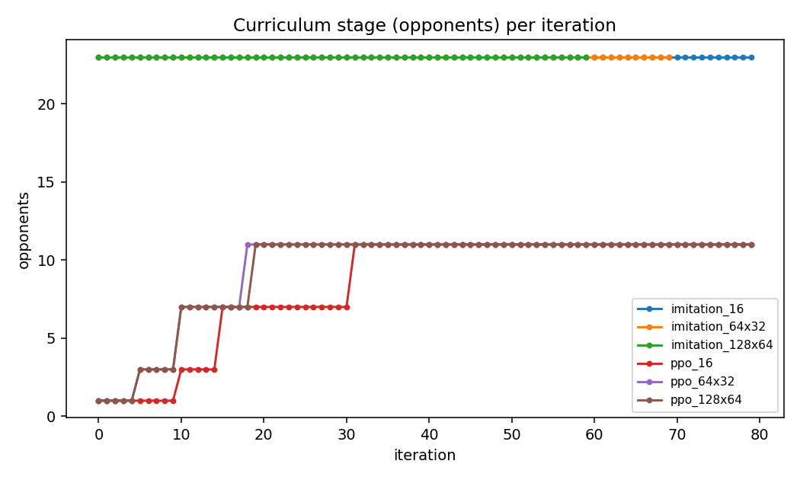
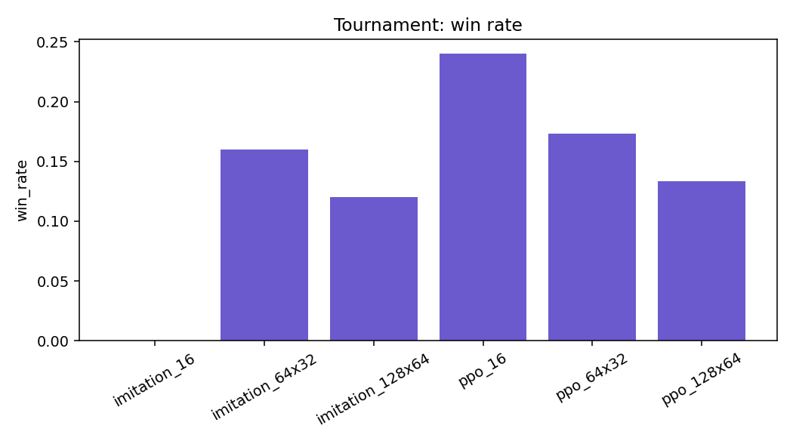

# Results: network sizes

**Run:** `results/sizes_20260903_135744`.
**Command:** `experiments/run_full.sh`, second block:

```bash
python experiments/run_comparison.py --methods imitation,ppo --warm --curriculum --sizes 16,64x32,128x64 \
  --iterations 80 --until-win 0.5 --window 5 --games 75 --workers 6 --seed 0 --name sizes
```

**Machine:** the same 8-core Mac, 6 workers, about 40 minutes. No extension phase in this run.
**Files here:** [report.md](report.md), [results.csv](results.csv), [summary.json](summary.json), [config.json](config.json) and the charts named below.

## What was run

Three hidden-layer shapes for the same 50-input, 16-output network: one hidden layer of 16 nodes, the default 64 then 32, and 128 then 64. For each shape, imitation pretraining against the full field (up to 80 epochs, stopping at the win criterion), then PPO warm-started from that shape's imitation champion and climbing the opponent curriculum for up to 80 iterations. Then the 75-game tournament for all six champions.

| shape | weights | imitation variant | PPO variant, warm from |
| --- | --- | --- | --- |
| 16 | 1,088 | `imitation_16` | `ppo_16`, from `imitation_16` |
| 64x32 | 5,872 | `imitation_64x32` | `ppo_64x32`, from `imitation_64x32` |
| 128x64 | 15,824 | `imitation_128x64` | `ppo_128x64`, from `imitation_128x64` |

## Criterion and curriculum

| variant | reached | iterations to criterion | iterations trained | highest stage | validation accuracy (imitation) |
| --- | --- | --- | --- | --- | --- |
| imitation_16 | no | - | 80 | 23 opponents (no ladder) | 0.72 |
| imitation_64x32 | yes | 70 | 70 | 23 opponents | 0.84 |
| imitation_128x64 | yes | 60 | 60 | 23 opponents | 0.87 |
| ppo_16 | no | - | 80 | 11 opponents (promotions at 11, 16, 32) | |
| ppo_64x32 | no | - | 80 | 11 opponents (promotions at 6, 11, 19) | |
| ppo_128x64 | no | - | 80 | 11 opponents (promotions at 6, 11, 20) | |



## Tournament

| rank | variant | tournament win rate | mean score | mean survival (ticks) |
| --- | --- | --- | --- | --- |
| 1 | ppo_16 | 0.24 | 0.43 | 215 |
| 2 | ppo_64x32 | 0.17 | 0.05 | 217 |
| 3 | imitation_64x32 | 0.16 | -0.36 | 174 |
| 4 | ppo_128x64 | 0.13 | -0.74 | 157 |
| 5 | imitation_128x64 | 0.12 | -0.64 | 172 |
| 6 | imitation_16 | 0.00 | -1.35 | 123 |



## What it shows

1. **Imitation needs width to copy the teacher.** The 16-node network reached only 72 percent validation accuracy against the voting brain's choices, never met the win criterion, and won no tournament game. 64x32 reached 84 percent and 128x64 reached 87 percent, and both met the criterion (at epochs 70 and 60).
2. **PPO fine-tuning prefers the smallest network.** Warm PPO on 16 nodes won 18 of 75 tournament games (0.24), the highest win rate of any champion in any run here, despite starting from the weakest teacher copy. 64x32 gave 0.17 and 128x64 gave 0.13. Fewer weights means a cleaner gradient from 24 sparse-reward trajectories per update, and the curriculum then does the teaching the imitation stage could not: `ppo_16` was promoted at iterations 11, 16 and 32.
3. **Bigger is not better past 64x32.** The 128x64 imitation copy was the most accurate, yet its PPO fine-tune ended with the lowest survival (157 ticks) and the lowest PPO win rate. More weights, same data, more drift.
4. **Every PPO variant stalled at eleven opponents** within 80 iterations, as the warm PPO did in the main run. The entropy of all three rose during fine-tuning (0.45 to about 1.2 for the two larger shapes), the same un-sharpening seen there.

The default of 64 then 32 is a reasonable compromise: it copies the teacher well and fine-tunes well. If the goal is the strongest fine-tuned policy rather than the most faithful copy, 16 hidden nodes did better in this run.

## Limitations

- One seed, two validation games per iteration (one for imitation). The differences between 0.13 and 0.17 are a few games out of 75.
- `imitation_16` reports 1,126 training seconds against about 75 for the other shapes because one of its epochs took 951 seconds while the machine was swapping; the per-epoch time is otherwise about the same for all three.
- Champions were chosen by validation score rather than curriculum stage, as in the main run.

## Charts

| Chart | What it shows |
| --- | --- |
| [tournament_win_rate.png](tournament_win_rate.png) | Share of tournament games won per champion |
| [tournament_mean_score.png](tournament_mean_score.png) | Mean tournament return |
| [tournament_mean_survival.png](tournament_mean_survival.png) | Mean ticks survived in the tournament |
| [win_rate_by_method.png](win_rate_by_method.png) | Validation win rate per iteration |
| [curriculum_by_method.png](curriculum_by_method.png) | Opponents per iteration |
| [score_by_time.png](score_by_time.png) | Training score against the clock |
| [entropy_by_method.png](entropy_by_method.png) | Policy entropy per iteration |
| [length_by_method.png](length_by_method.png) | Mean ticks survived per iteration |
| [train_seconds.png](train_seconds.png) | Training time per variant |
