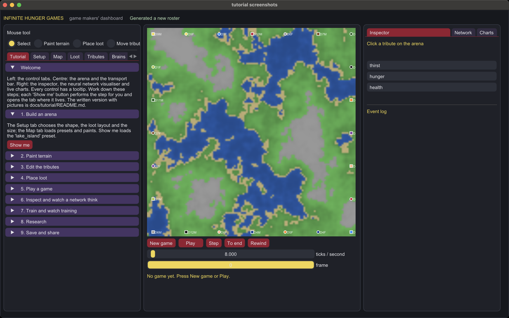
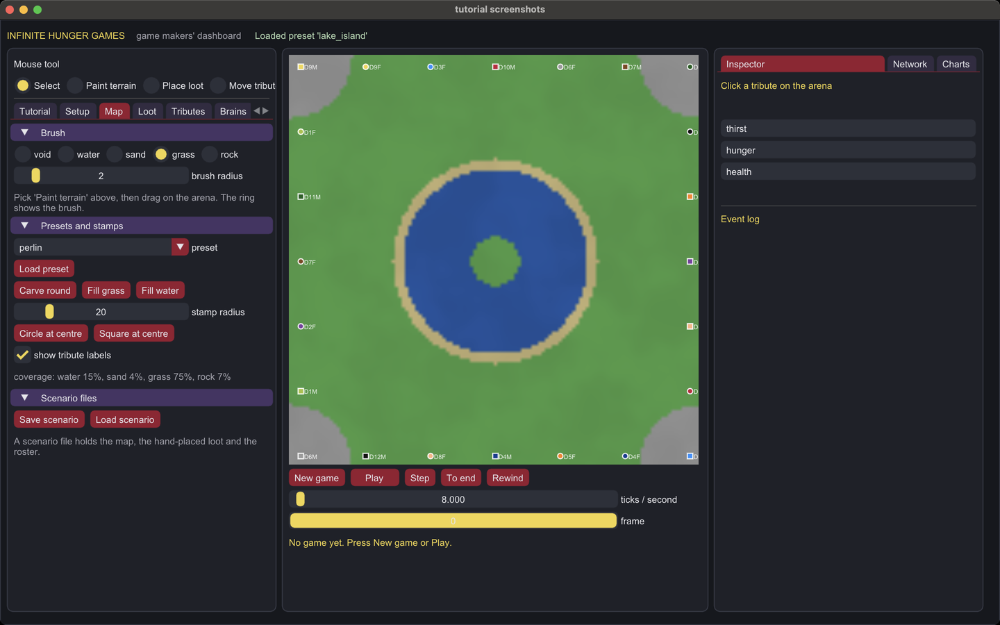
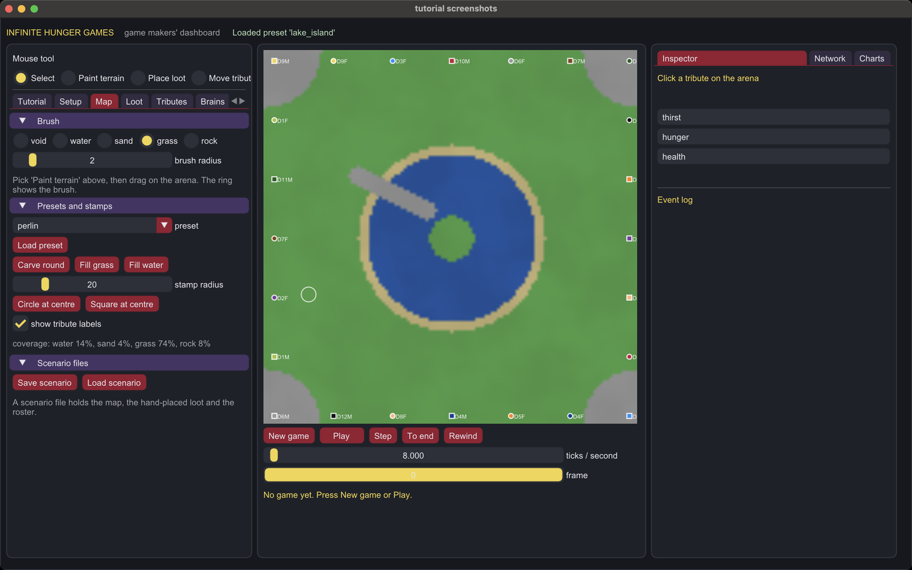
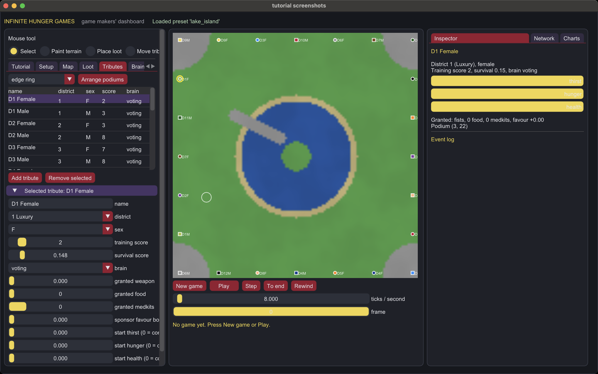
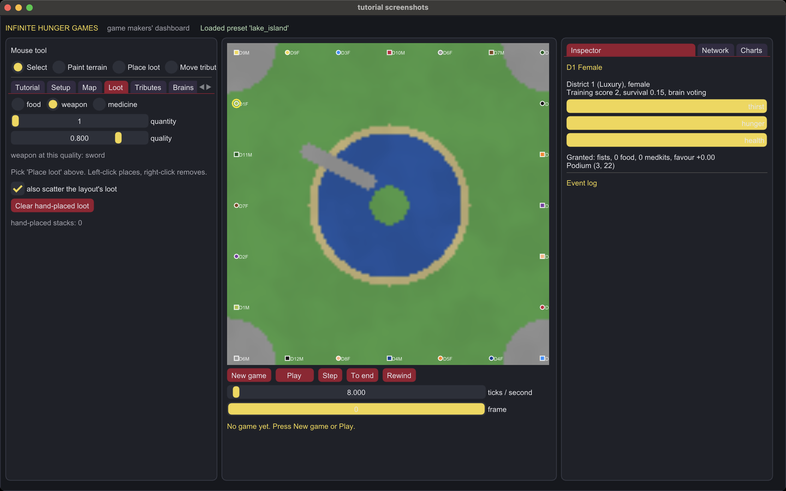
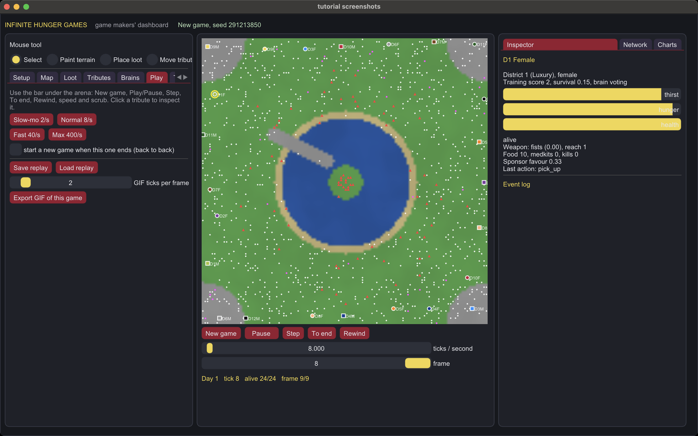
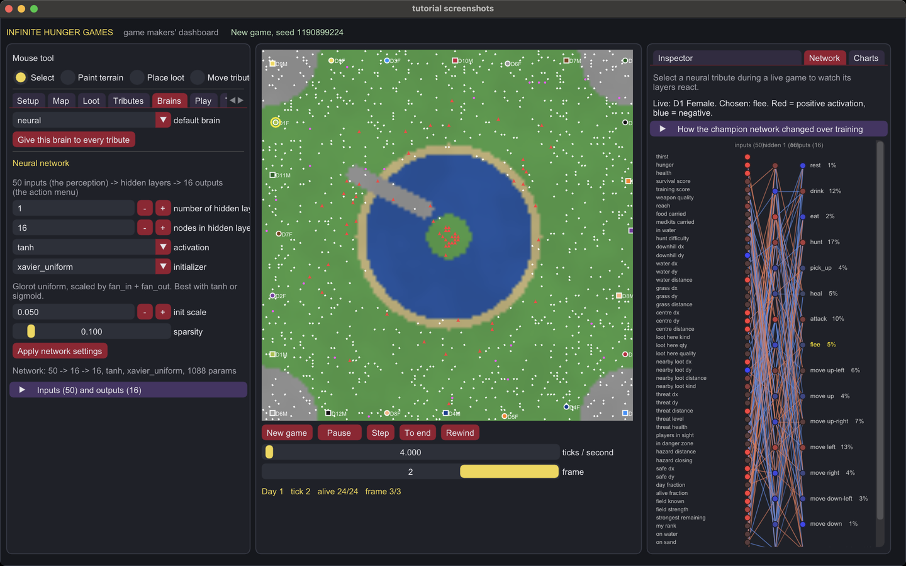
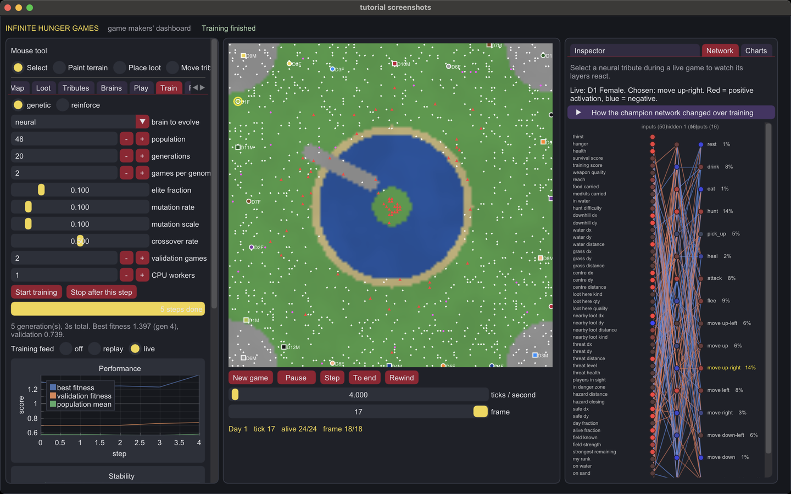
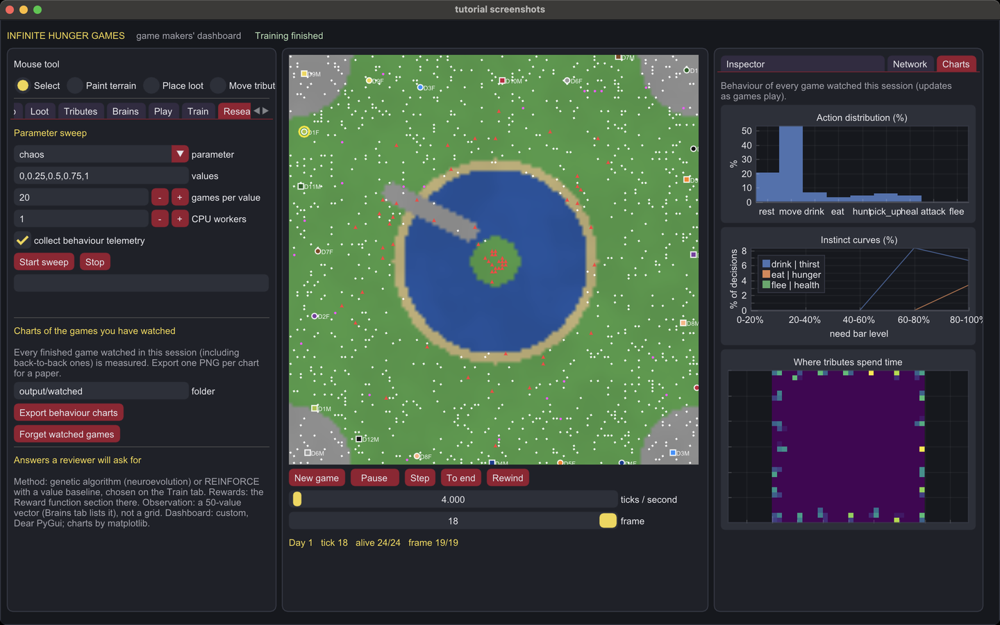

# Tutorial: from first launch to a trained brain

This is the written version of the dashboard's Tutorial tab. Every picture
was taken from the real dashboard by `python -m hunger_games.ui.screenshots`,
so what you see here is what you get. Each step names the tab it lives in
and the "Show me" button that performs it for you.

## 0. Install and launch

```bash
pip install -r requirements.txt
python -m hunger_games ui
```

The window has three panels. Left: the control tabs, starting with this
tutorial. Centre: the arena and the transport bar. Right: the inspector, the
neural network visualiser and live behaviour charts. Hover any control for a
tooltip.



## 1. Build an arena

The **Setup** tab chooses the shape (the 74th games' open field or the 75th
games' circle), the loot layout (the video's ring redesign or the original
Cornucopia pile), the size, the seed and the chaos dial. Changing any of
those regenerates the arena at once and moves tributes off any void. The
**Map** tab loads presets: Perlin hills, flat field, flat round, the 75th
games' island in a sea (`quarter_quell`) and a lake with an island.



## 2. Paint terrain

Pick **Paint terrain** at the top, choose a terrain and a brush radius on the
Map tab, and drag on the arena. A ring follows the mouse showing the brush.
Stamps put a circle or square of the chosen terrain at the centre, and
"Carve round" turns the map into a circle. Save the result as a scenario.



## 3. Edit the tributes

The **Tributes** tab lists the roster: click a name, or a dot on the arena
with the Select tool, to edit that tribute. Rename them, change district,
sex, training and survival scores, brain, grant a weapon, food, medkits or
sponsor favour, and set starting bars. Podium presets place everyone along
the edge, around the cornucopia, at random, or in two camps; the **Move
tribute** tool drags one tribute at a time. Female tributes are circles,
males squares, coloured by district.



## 4. Place loot

The **Loot** tab sets a kind, quantity and quality. With the **Place loot**
tool, left-click places a stack and right-click removes it. Weapons are red
triangles, food white dots, medicine magenta crosses. A weapon's quality
decides its name, reach and damage.



## 5. Play a game

**New game** builds a game from your settings, map and roster and records
every tick. **Play** and **Pause**, **Step**, **To end** and **Rewind** sit
under the arena with the speed slider (from slow motion to 400 ticks per
second) and the frame slider for scrubbing. Parachutes appear above tributes
receiving sponsor gifts; a red cross marks an elimination. The **Play** tab
has speed presets, back-to-back games, replay files and GIF export.



## 6. Inspect a tribute and watch its network think

Click a tribute for its bars, weapon, kills, sponsor favour and last action
in the **Inspector**. Give tributes the neural brain on the **Brains** tab,
where you set the number of hidden layers and the nodes in each, the
activation and the initializer, and where the 50 inputs and 16 outputs are
listed. During a live game the **Network** tab draws the selected tribute's
network as a node graph: red nodes are positive activations, blue negative,
warm edges positive weights, cool edges negative, and the chosen action is
highlighted in gold. The picture updates every tick.



## 7. Train, and watch training happen

The **Train** tab has two methods. **genetic** evolves a population of
genomes by playing them against each other (neural or voting brains).
**reinforce** trains the neural brain by policy gradient with a value
baseline, using the reward function shown on the same tab. Both log every
step to the Performance, Stability and Time plots, and the Champion genes
plot highlights in gold the genes that changed since the previous step.

The **training feed** is how you watch training. Set it to **replay** and
after every step the arena replays one real evaluation game from that step.
Set it to **live** and the newest champion is given to the learner slots and
plays a fresh game live, so the Network tab shows real activations. The
Network tab's "How the champion network changed over training" section
plots the size of each step's change and the genome as a heat map.



When training ends, **Champion to all** or **Watch champion** puts the best
brain into the roster, **Save run folder** writes `results/<name>_<timestamp>/`
with the config, history, champion and one PNG per chart plus a growing-curve
GIF, and **Save champion** writes a JSON file you can load into any roster.

## 8. Research

The **Research** tab sweeps any setting over a list of values, playing the
same seeded games on the painted map for each, and writes a run folder with
one chart per metric. It also exports one PNG per behaviour chart for every
game you have watched in this session. The **Charts** tab on the right shows
the same behaviour live. The [research guide](../research/README.md) explains
which chart answers which question.



## 9. Save and share

Configs (Setup), scenarios (Map), replays (Play), champions and run folders
(Train) all save to files. The command line and the `experiments/` scripts
reproduce anything the dashboard does; see the [README](../../README.md).

## Regenerating these pictures

```bash
python -m hunger_games.ui.screenshots docs/tutorial/images
```

On macOS the tool captures only the dashboard window, by its window id, and
needs Screen Recording permission for your terminal or editor.
